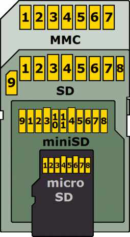

SD Storage
==========

.. highlight: c++

Provides :component:`Storage` support for SD cards.

This code is ported from the :library:`SDCard` library.

Currently uses only SPI communication, which offers only a limited interface
and is not supported by SDUC cards.

SD Card connections
-------------------

   See https://en.wikipedia.org/wiki/SD_card

==========  =======  ============  ============  =====  ====  =======  ======================================
MMC pin     SD pin   miniSD pin    microSD pin   Name   I/O   Logic    Description
==========  =======  ============  ============  =====  ====  =======  ======================================
1           1        1             2             nCS    I     PP       SPI Card Select [CS] (Negative logic)
2           2        2             3             DI     I     PP       SPI Serial Data In [MOSI]
3           3        3                           VSS    S     S        Ground
4           4        4             4             VDD    S     S        Power
5           5        5             5             CLK    I     PP       SPI Serial Clock [SCLK]
6           6        6             6             VSS    S     S        Ground
7           7        7             7             DO     O     PP       SPI Serial Data Out [MISO]
-           8        8             8             NC     -     -        Unused (memory cards)
                                                 nIRQ   O     OD       Interrupt (SDIO cards) (negative logic)
-           9        9             1             NC                    Unused
-           -        10            -             NC                    Reserved
-           -        11            -             NC                    Reserved
==========  =======  ============  ============  =====  ====  =======  ======================================

Usage
-----

- Code should be built with :envvar:`ENABLE_STORAGE_SIZE64` =1 unless using a very small card (1 or 2GB)::

- Add required libraries to your project's component.mk file::

    COMPONENT_DEPENDS := SdStorage FatIFS

- Create and initialise a Card Device instance::

    #include <Storage/SD/Card.h>

    // GPIO used for Chip Select (Esp8266)
    #define PIN_CARD_CS 5

    // Create the SD card Device and register with the Storage library
    auto card = new Storage::SD::Card("card1", SPI);
    Storage::registerDevice(card);

    if(!card->begin(PIN_CARD_CS)) {
        // Handle error here
        return;
    }

    // Display some information
    Serial << "CSD" << endl << card->csd << endl;
    Serial << "CID" << endl << card->cid;

At this point, the card can be accessed directly using :cpp:class:`Storage::Device` methods.
If the card has been formatted then the partitions can be accessed using the standard Storage API.
For example::

    Storage::Partition part;

    // Find the first FAT partition on the card
    part = *card->partitions().find(Storage::Partition::SubType::Data::fat);

    // Get the first partition (of any type)
    part = *card->partitions().begin();

    // Iterate through all partitions
    for(part: card->partitions()) {
        Serial << part << endl;
    }

- To create a partition table on the card::

    #include <Storage/Disk/GPT.h>

    Storage::Disk::GPT::PartitionTable table;
    // Create one partition using 100% of all available space
    table.add("My FAT partition", 0, 100);
    auto err = Storage::Disk::formatDisk(*card, table);
    Serial << "formatDisk: " << err << endl;
    if(!!err) {
        // If formatting fails, the disk will left in an indeterminate state!
        ...
        return;
    }

    // Fetch the first (and only) partition
    auto part = card->partitions().begin();

.. note::

    To use the entire card as a single partition, it is not necessary to pre-format the disk.
    Instead, construct a partition spanning the entire disk::

        auto part = card->editablePartitions().add("My Partition",
          Storage::Partition::SubType::Data::fat, 0, card->getSize());

    This approach is sometimes referred to as an ``SFD`` (Single Filing-system Device).

The partition can now be formatted with the required filing system (FAT)::

    int res = IFS::FAT::formatVolume(part);
    Serial << "formatVolume : " << IFS::Error::toString(res) << endl;

Once formatted, the partition can be mounted as usual::

    auto fatfs = IFS::createFatFilesystem(part);
    if(fatfs != nullptr) {
        if(fatfs->mount() == FS_OK) {
            // OK, access the filing system
            Serial << fatfs->getContent("My file.txt") << endl;
        } else {
            // Mount failed, destroy the objects
            delete fs;
            delete card; // Also de-registers the card with the Storage API
        }
    }

API Documentation
-----------------

.. doxygennamespace:: Storage::SD
   :members:
